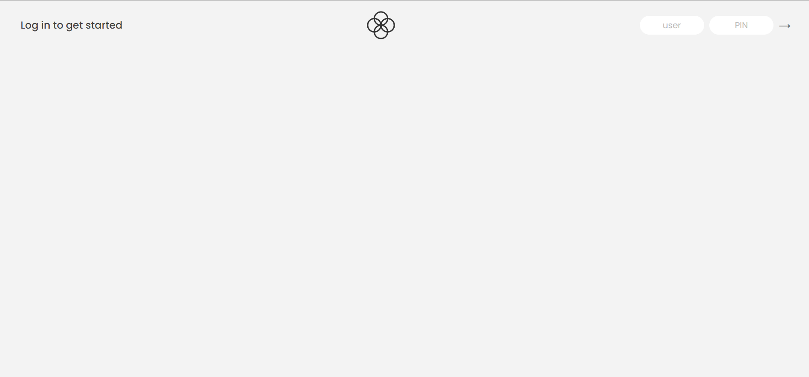
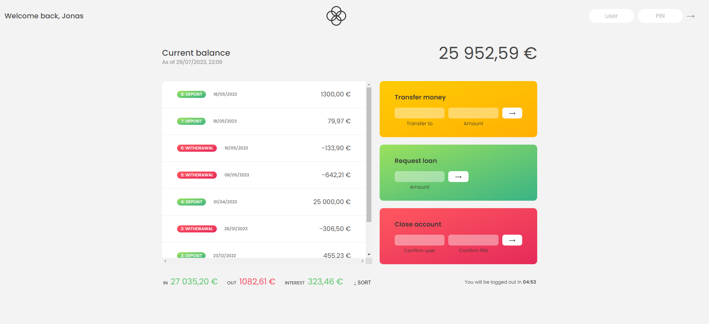

# Bankist App 💵

Made this project as part of a JavaScript course on Udemy by Jonas Schmedtmann.  
By doing this project I practiced working with array methods, numbers, dates, Intl, and DOM manipulation in JavaScript.

[👉Live Preview👈]()

## What is Bankist?

Bankist is a fictional online bank.

## Functionalities

- Login
- Transfer a value to another account
- Get loans
- Close (delete) account
- Log out after 5 minutes

## Test Username and PIN

The project does not include any backend and does not have an actual registration functionality.

### Account One

Username: js 
PIN: 1111 

### Account Two

username: jd 
PIN: 2222 

## Login Page

## User Page

(UI by Jonas Schmedtmann. This project is NOT responsive!)

